# MVP · Pipeline de dados de preços de combustíveis no Brasil (ANP)

**Autor:** Rodrigo Ferraz · **Plataforma:** Databricks Free Edition (Lakehouse, Delta Lake, Unity Catalog) · **Linguagens:** PySpark e SQL

> Pipeline de ponta a ponta que coleta **1,24 milhão de preços de combustíveis** publicados pela ANP (jan/2025 a jun/2026), organiza os dados na **Arquitetura Medalhão** (Bronze → Silver → Gold), modela um **esquema estrela** documentado no Unity Catalog e responde a perguntas de negócio sobre a evolução dos preços, as diferenças entre estados, o efeito da bandeira do posto e a competitividade do etanol.

**Principais resultados:**
- Toda a alta de preços do período se concentrou em **março e abril de 2026**, quando o **diesel S10 subiu 21,8% em dois meses** (de R$ 6,12 para R$ 7,45).
- O **Acre** tem os combustíveis mais caros do país: **R$ 1,51 a R$ 1,73 por litro a mais** que os estados mais baratos.
- O **etanol só compensou com frequência em 6 estados do Centro-Sul**. Em 18 dos 27 estados, ele nunca compensou.
- Postos **bandeirados** cobram **R$ 0,12 a R$ 0,15 a mais por litro**, comparando postos do mesmo município no mesmo mês.
- O choque de 2026 **não atingiu os estados por igual**: o diesel subiu **31,2% na Bahia** e só **8,5% no Acre**. Os estados estruturalmente mais caros foram os que **menos** subiram, e o choque **reduziu as diferenças regionais**.

---

## Sumário

1. [Contexto de Negócios e Perguntas (Etapa 2 e 4.1)](#1-contexto-de-negócios-e-perguntas-etapa-2-e-41)
2. [Carga dos Dados (Etapa 4.2)](#2-carga-dos-dados-etapa-42)
3. [Modelagem e Catálogo de Dados (Etapa 4.3)](#3-modelagem-e-catálogo-de-dados-etapa-43)
4. [Pipeline de Dados (Etapa 4.4)](#4-pipeline-de-dados-etapa-44)
5. [Qualidade de Dados (Etapa 4.5)](#5-qualidade-de-dados-etapa-45)
6. [Análise de Dados (Etapa 4.5)](#6-análise-de-dados-etapa-45)
7. [Autoavaliação](#7-autoavaliação)
8. [Como reproduzir](#8-como-reproduzir)

---

## 1. Contexto de Negócios e Perguntas (Etapa 2 e 4.1)

### 1.1 Problema

O preço dos combustíveis afeta diretamente o orçamento das famílias, o custo do frete e a inflação. No Brasil, os preços são livres na revenda e variam bastante entre estados, municípios e postos. O consumidor ainda precisa decidir entre **etanol e gasolina**, e essa escolha depende da relação entre os dois preços.

**Perspectiva do autor:** trabalho há mais de uma década no setor de óleo e gás offshore, na ponta *upstream* da cadeia, onde se decide a produção de petróleo. Este MVP olha para a outra ponta, a bomba de combustível, para entender **como o preço chega ao consumidor final**: quanto dele é explicado pela geografia e pela logística, quanto pela concorrência entre postos e como as variações do mercado internacional se propagam pelo país. Os dados de revenda da ANP permitem observar esse "último elo" da cadeia com granularidade de posto e de semana.

**Objetivo:** entender como os preços de revenda dos principais combustíveis variam no Brasil **ao longo do tempo, entre estados e entre tipos de posto**, e em que situações o **etanol compensa** em relação à gasolina, usando os dados oficiais da ANP de **janeiro de 2025 a junho de 2026**.

### 1.2 Perguntas de negócio

*Objetivo registrado antes da coleta e mantido intacto até o fim do trabalho, conforme a orientação do enunciado. O resultado de cada pergunta está avaliado na [Autoavaliação](#7-autoavaliação).*

| # | Pergunta | Tipo | Decisão técnica que ela orienta |
|---|---|---|---|
| **P1** | Como evoluiu o preço médio mensal da gasolina comum, do etanol e do diesel S10 no período? | Núcleo | Granularidade temporal mensal; dimensão de tempo |
| **P2** | Quais UFs têm os maiores e os menores preços médios de gasolina comum e diesel S10, e qual a diferença entre elas? | Núcleo | Dimensão de localidade (região, UF, município) |
| **P3** | Em quais UFs o etanol é economicamente vantajoso (razão etanol/gasolina ≤ 0,70) e com que frequência? | Núcleo | Padronização de produto; agregado mensal por UF |
| **P4** | Postos bandeirados cobram mais que postos de bandeira branca? Quanto, por produto? | Núcleo | Dimensão de posto com tipo de bandeira |
| **P5** | Em quais capitais a dispersão de preços da gasolina entre postos é maior? | Fronteira | Grão do fato no nível do posto; indicador de capital |
| **P6** | É possível estimar a margem bruta da revenda (preço de venda − preço de compra)? | Fronteira | Manter o campo `valor_compra` e medir sua completude |
| **P7** | Quais UFs sofreram a maior alta no choque de preços de mar-abr/2026? | **Adicionada na análise** | Reutiliza o agregado mensal da Gold, sem nenhuma mudança no modelo |

As perguntas de **fronteira** foram incluídas de propósito: elas testam os limites da base e alimentam a autoavaliação.

A **P7 não fazia parte do objetivo original** (P1 a P6, mantidas intactas). Ela surgiu durante a análise, a partir do choque identificado na P1, e está registrada separadamente por transparência. O fato de ter sido respondida **sem nenhuma alteração no pipeline** é, em si, uma evidência de que o modelo dimensional é flexível para novas perguntas.

**Matriz de rastreabilidade (pergunta → dados → modelo):**

| Pergunta | Campos da fonte | Tabelas usadas |
|---|---|---|
| P1 | Data da Coleta, Produto, Valor de Venda | `gold.agg_preco_mensal_uf` |
| P2 | Estado - Sigla, Produto, Valor de Venda | `gold.agg_preco_mensal_uf` |
| P3 | Estado - Sigla, Produto, Valor de Venda, Data da Coleta | `gold.agg_preco_mensal_uf` |
| P4 | Bandeira, Municipio, Produto, Valor de Venda | `gold.fato_preco_revenda`, `dim_posto`, `dim_produto`, `dim_tempo` |
| P5 | Municipio, CNPJ da Revenda, Valor de Venda | `gold.fato_preco_revenda`, `dim_localidade` |
| P6 | Valor de Compra | `silver.precos_revenda` |
| P7 | Estado - Sigla, Produto, Valor de Venda, Data da Coleta | `gold.agg_preco_mensal_uf` |

### 1.3 Fonte dos dados

| Item | Descrição |
|---|---|
| Conjunto | **Série Histórica de Preços de Combustíveis e de GLP**, ANP (Agência Nacional do Petróleo, Gás Natural e Biocombustíveis) |
| Página oficial | https://www.gov.br/anp/pt-br/centrais-de-conteudo/dados-abertos/serie-historica-de-precos-de-combustiveis |
| Origem | Levantamento de Preços de Combustíveis (LPC): pesquisa **semanal** feita por empresa contratada pela ANP, em cumprimento ao art. 8º da Lei nº 9.478/1997 (Lei do Petróleo) |
| Responsável | ANP/SDC (Superintendência de Defesa da Concorrência), contato sdc@anp.gov.br |
| Arquivos usados | Combustíveis automotivos, dados semanais agrupados por semestre: `ca-2025-01.zip`, `ca-2025-02.zip`, `ca-2026-01.zip`. Cada `.zip` contém um único CSV |
| Formato | CSV em UTF-8, separador `;`, vírgula decimal, datas em `dd/mm/aaaa` |
| Produtos | Gasolina comum, gasolina aditivada, etanol hidratado, diesel S500, diesel S10 e GNV |
| Volume | **1.236.149 registros brutos**, cerca de 17,8 mil postos, 408 municípios, 27 UFs, 416 datas de coleta |

**Estrutura dos dados brutos** (uma tabela; uma linha = o preço de um produto em um posto em uma data de coleta), conforme o dicionário oficial da ANP:

| Coluna original | Descrição (metadados ANP) | Tipo (ANP) |
|---|---|---|
| Regiao - Sigla | Sigla da região da revenda | alfanumérico |
| Estado - Sigla | Sigla da UF da revenda | alfanumérico |
| Municipio | Nome do município da revenda | alfanumérico |
| Revenda | Nome da revenda | alfanumérico |
| CNPJ da Revenda | CNPJ da revenda | numérico |
| Nome da Rua | Logradouro | alfanumérico |
| Numero Rua | Número do logradouro | alfanumérico |
| Complemento | Complemento do endereço | alfanumérico |
| Bairro | Bairro | alfanumérico |
| Cep | CEP do logradouro | alfanumérico |
| Produto | Combustível pesquisado | alfanumérico |
| Data da Coleta | Data da coleta do preço | data |
| Valor de Venda | Preço ao consumidor final na data da coleta | numérico |
| Valor de Compra | Preço de distribuição (**série disponível até agosto de 2020**) | numérico |
| Unidade de Medida | Unidade do preço | alfanumérico |
| Bandeira | Marca da distribuidora exibida pelo posto; "BRANCA" = sem marca | alfanumérico |

**Característica importante da amostra:** a pesquisa é **amostral** e proporcional ao tamanho dos mercados. O Sudeste concentra **48% dos registros**, e só São Paulo, **28%**. Isso é levado em conta na interpretação das médias nacionais.

### 1.4 Licença e uso dos dados

- Os dados são **dados abertos governamentais**, publicados pela ANP no âmbito da Política de Dados Abertos do Poder Executivo Federal (**Decreto nº 8.777/2016**), com Plano de Dados Abertos próprio, e também listados no Portal Brasileiro de Dados Abertos (dados.gov.br).
- Dados abertos governamentais podem ser **livremente acessados, utilizados, modificados e compartilhados**, inclusive para fins acadêmicos e comerciais, desde que **citada a fonte**. A fonte é citada neste documento e nos metadados das tabelas (coluna `_fonte`).
- **Licença específica:** o portal dados.gov.br não exibe uma licença específica para este conjunto (consulta em 27/09/2026). O uso segue a Política de Dados Abertos do Poder Executivo Federal (Decreto nº 8.777/2016), que prevê a livre utilização dos dados abertos, com citação da fonte.
- **LGPD:** os registros identificam **pessoas jurídicas** (postos revendedores, por CNPJ e razão social), e não pessoas físicas. Mesmo assim, por minimização, os campos de endereço detalhado (rua, número, complemento) foram descartados a partir da Silver.

---

## 2. Carga dos Dados (Etapa 4.2)

**Estratégia:** padrão **ELT**. O dado é carregado bruto no Lakehouse e transformado dentro da própria plataforma.

1. **Aquisição automática:** o notebook baixa os três arquivos semestrais (`.zip`) **diretamente do portal da ANP para o Volume** do Unity Catalog, via HTTP, sem nenhuma etapa manual. Isso torna a carga totalmente **reprodutível**. Se o ambiente não tivesse acesso à internet, o notebook permitiria upload manual como alternativa.
2. **Landing zone:** Volume `bronze.arquivos_anp`. O notebook extrai automaticamente o CSV de cada `.zip`.
3. **Leitura:** cada CSV é lido como **texto** (sem inferência de tipos), com detecção automática de codificação. Os 3 arquivos foram lidos em **UTF-8**, com as **16 colunas oficiais encontradas em todos** (nenhuma faltante ou extra).
4. **Metadados de controle:** `_arquivo_origem`, `_encoding_detectado`, `_fonte` e `_data_ingestao`.
5. **Gravação:** tabela Delta `bronze.precos_revenda_raw`, em modo `overwrite` (reprodutível e idempotente).

| Arquivo | Registros |
|---|---|
| 1º semestre de 2025 | 429.523 |
| 2º semestre de 2025 | 384.208 |
| 1º semestre de 2026 | 422.418 |
| **Total na Bronze** | **1.236.149** |

**Script:** [`notebooks/01_ingestao_bronze.py`](notebooks/01_ingestao_bronze.py)

**Evidências:**

Download automático dos arquivos da ANP:
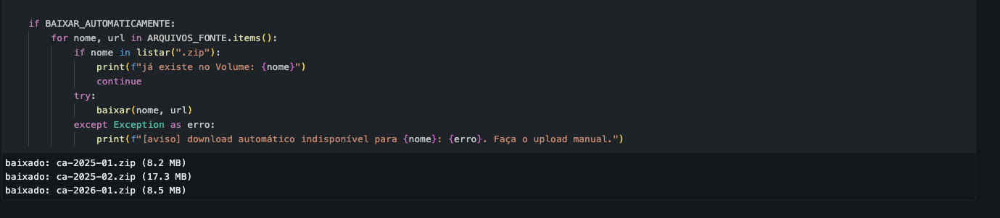

Extração dos CSVs:
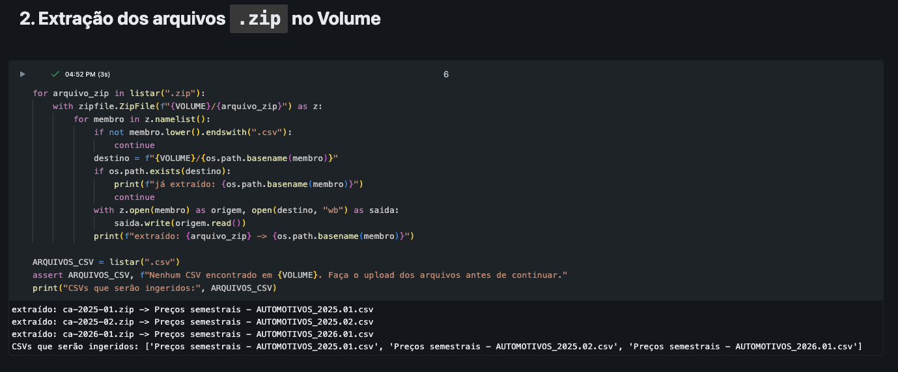

Arquivos no Volume do Unity Catalog:
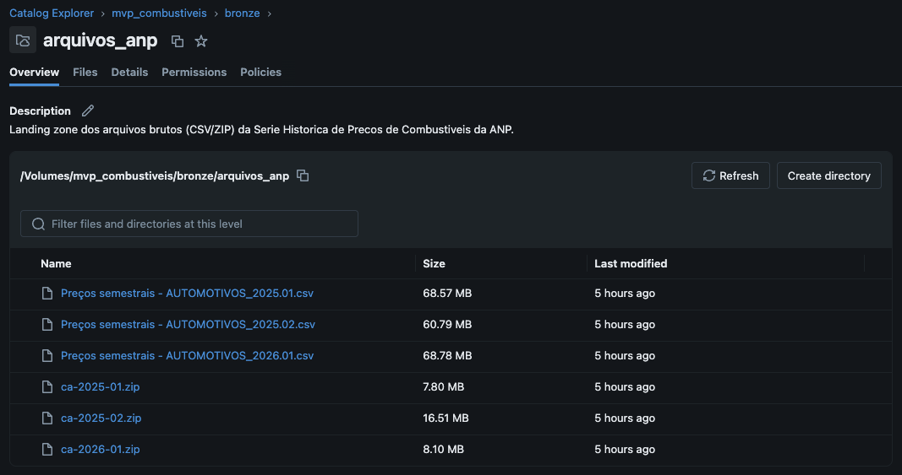

Leitura: codificação e colunas encontradas:
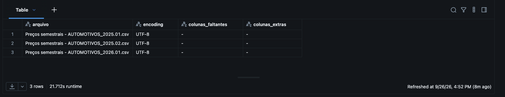

Registros gravados por arquivo:
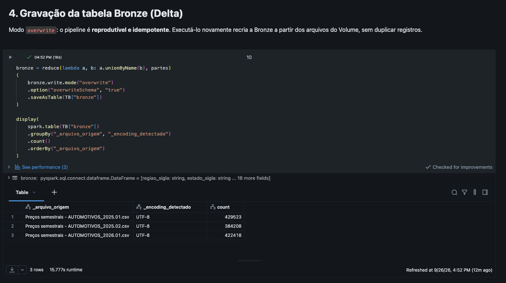

---

## 3. Modelagem e Catálogo de Dados (Etapa 4.3)

### 3.1 Organização no Lakehouse

Catálogo dedicado **`mvp_combustiveis`**, com um schema por camada:

| Camada | Schema | Tabelas | Papel |
|---|---|---|---|
| Bronze | `bronze` | `precos_revenda_raw` + Volume `arquivos_anp` | Dado como veio, com metadados de controle |
| Silver | `silver` | `precos_revenda`, `precos_revenda_rejeitados`, `relatorio_qualidade` | Dado limpo, tipado e deduplicado; auditoria de rejeitados; resultados de qualidade |
| Gold | `gold` | `fato_preco_revenda`, `dim_tempo`, `dim_localidade`, `dim_produto`, `dim_posto`, `agg_preco_mensal_uf` | Esquema estrela e agregado para as perguntas |

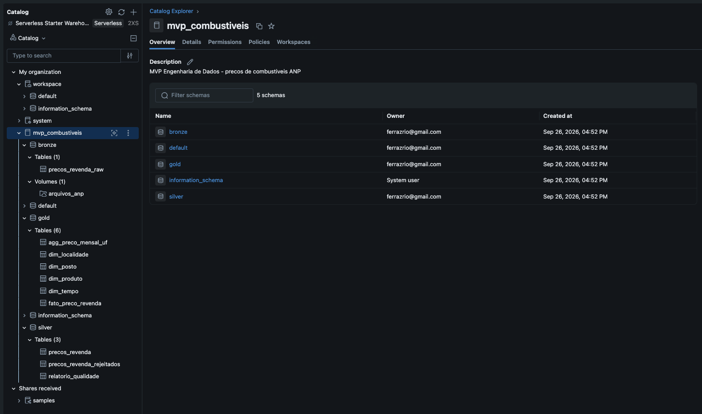

Configuração do ambiente (notebook `00_setup`):
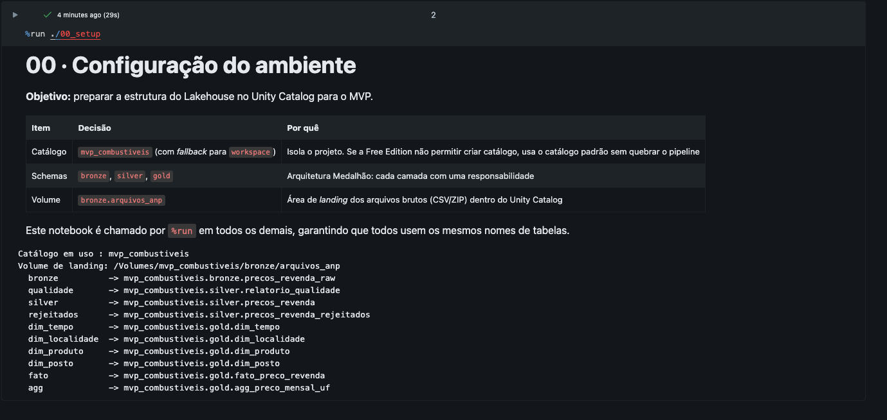

### 3.2 Esquema estrela

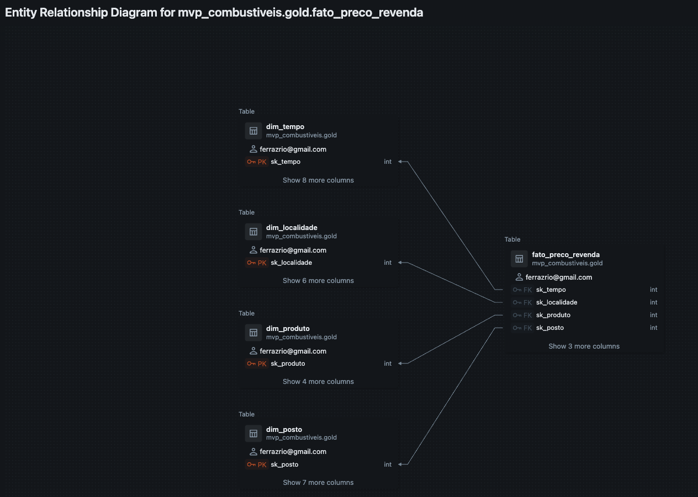

*Diagrama gerado pelo próprio Unity Catalog a partir das restrições PK/FK declaradas no notebook 04.*

**Por que estrela:** há um evento central e mensurável (um preço coletado), descrito por **quando** (tempo), **onde** (localidade), **o quê** (produto) e **quem** (posto e bandeira). As perguntas viram agregações simples sobre o fato. Não se optou por *snowflake* porque as dimensões são pequenas, e a normalização só tornaria as consultas mais complexas.

**Grão do fato:** um preço de um produto em um posto em uma data de coleta. Esse é o nível mais detalhado disponível, e é ele que viabiliza a P5 (dispersão entre postos) e a P4b (comparação dentro do mesmo município).

**Decisões de modelagem:**
- **Chaves substitutas** (`sk_*`), com restrições **PK/FK informativas** no Unity Catalog, que geram o diagrama acima.
- **`produto_analise`**: categoria padronizada para as análises. A ANP rotula a gasolina comum apenas como "GASOLINA" e o diesel S500 apenas como "DIESEL", e a padronização deixa isso explícito.
- **`dim_posto` como SCD tipo 1**: guarda os atributos mais recentes do posto. Trocas de bandeira no período ficam sinalizadas em `qtd_bandeiras_periodo`. É uma simplificação consciente do MVP.
- **Agregado `agg_preco_mensal_uf`**: métrica pré-calculada (média, mediana, mínimo e máximo por UF, produto e mês), **sem outliers**, que atende às perguntas P1 a P3.

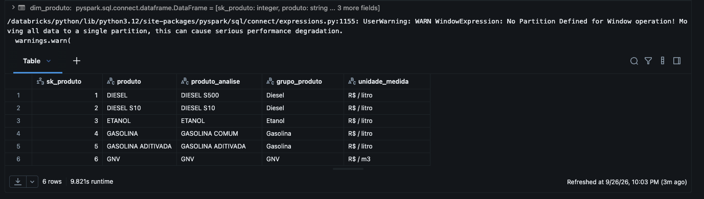

*A `dim_produto` mostra a padronização dos rótulos e o GNV com unidade única (`R$ / m3`), resultado da transformação T1b.*

### 3.3 Catálogo de dados

O catálogo foi **gravado no próprio Unity Catalog** (comentários de tabela e de coluna via `COMMENT ON TABLE` e `ALTER COLUMN ... COMMENT`), incluindo descrição, tipo, domínio e linhagem de cada campo. Está transcrito abaixo.

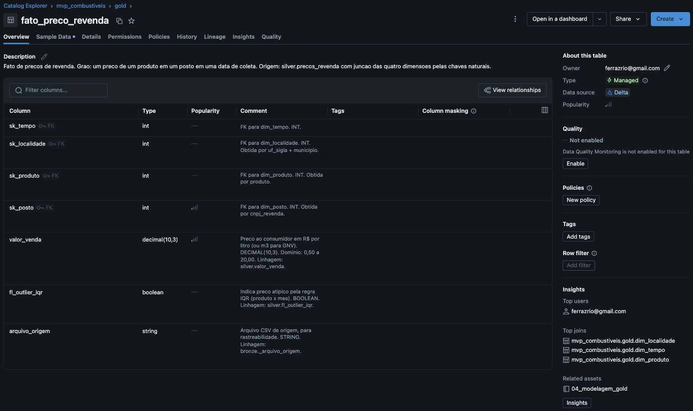

**Linhagem de ponta a ponta**, gerada automaticamente pelo Unity Catalog: Volume → Bronze → Silver → dimensões e fato → agregado.

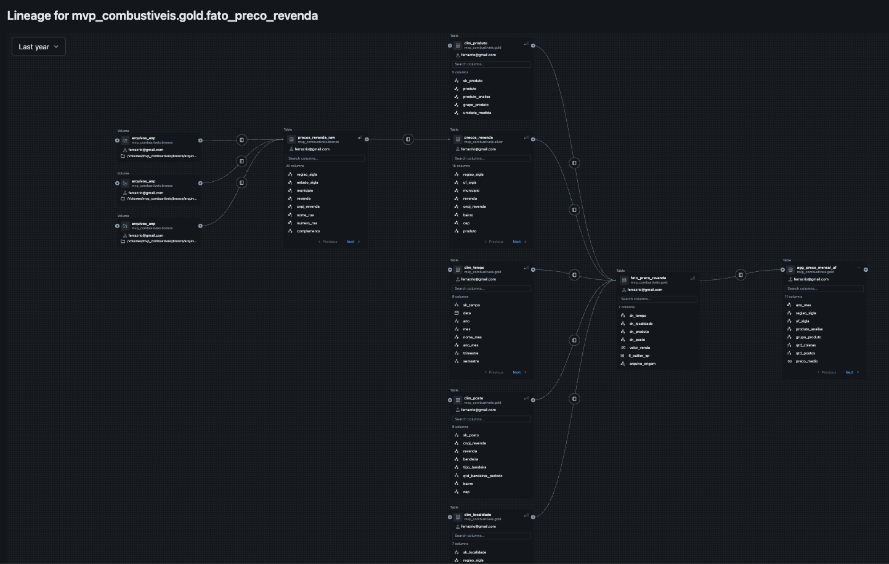

#### `bronze.precos_revenda_raw`
Preços de revenda exatamente como publicados pela ANP (todos os campos em texto). Uma linha = um preço de um produto em um posto em uma data.

| Coluna | Tipo | Descrição e domínio | Linhagem |
|---|---|---|---|
| regiao_sigla | STRING | Sigla da região. Domínio esperado: N, NE, CO, SE, S | CSV: Regiao - Sigla |
| estado_sigla | STRING | Sigla da UF. Domínio: 27 UFs | CSV: Estado - Sigla |
| municipio | STRING | Município do posto | CSV: Municipio |
| revenda | STRING | Razão social do posto | CSV: Revenda |
| cnpj_revenda | STRING | CNPJ com máscara | CSV: CNPJ da Revenda |
| nome_rua | STRING | Logradouro | CSV: Nome da Rua |
| numero_rua | STRING | Número | CSV: Numero Rua |
| complemento | STRING | Complemento (frequentemente vazio) | CSV: Complemento |
| bairro | STRING | Bairro | CSV: Bairro |
| cep | STRING | CEP (8 dígitos, com ou sem hífen) | CSV: Cep |
| produto | STRING | Combustível. Domínio: GASOLINA, GASOLINA ADITIVADA, ETANOL, DIESEL, DIESEL S10, GNV | CSV: Produto |
| data_coleta | STRING | Data `dd/mm/aaaa` | CSV: Data da Coleta |
| valor_venda | STRING | Preço com vírgula decimal (ex.: 6,29) | CSV: Valor de Venda |
| valor_compra | STRING | Preço de distribuição; esperado vazio (série encerrada em ago/2020) | CSV: Valor de Compra |
| unidade_medida | STRING | R$ / litro; R$ / m³ (GNV) | CSV: Unidade de Medida |
| bandeira | STRING | Distribuidora; BRANCA = sem bandeira | CSV: Bandeira |
| _arquivo_origem | STRING | Arquivo CSV de origem | Metadado de ingestão |
| _encoding_detectado | STRING | UTF-8 ou ISO-8859-1 | Metadado de ingestão |
| _fonte | STRING | Identificação da fonte | Metadado de ingestão |
| _data_ingestao | TIMESTAMP | Data e hora da carga | Metadado de ingestão |

#### `silver.precos_revenda`
Dados limpos, tipados, padronizados e deduplicados. Grão: posto (CNPJ) × produto × data de coleta.

| Coluna | Tipo | Descrição e domínio | Linhagem |
|---|---|---|---|
| regiao_sigla | STRING | N, NE, CO, SE, S | bronze.regiao_sigla (trim, maiúsculas) |
| uf_sigla | STRING | 27 UFs | bronze.estado_sigla (trim, maiúsculas) |
| municipio | STRING | Maiúsculas, sem acentos | bronze.municipio (T1) |
| revenda | STRING | Razão social padronizada | bronze.revenda (T1) |
| cnpj_revenda | STRING | 14 dígitos | bronze.cnpj_revenda (T2) |
| bairro | STRING | Padronizado | bronze.bairro (T1) |
| cep | STRING | 8 dígitos | bronze.cep (T2) |
| produto | STRING | GASOLINA, GASOLINA ADITIVADA, ETANOL, DIESEL, DIESEL S10, GNV | bronze.produto (T1) |
| unidade_medida | STRING | R$ / litro; R$ / m3 (GNV) | bronze.unidade_medida (trim, T1b) |
| bandeira | STRING | Distribuidora; BRANCA = sem bandeira | bronze.bandeira (T1) |
| data_coleta | DATE | 2025-01-01 a 2026-06-30 | bronze.data_coleta convertida (T3) |
| valor_venda | DECIMAL(10,3) | R$ 0,50 a R$ 20,00 | bronze.valor_venda (T4, T5) |
| valor_compra | DECIMAL(10,3) | Esperado nulo | bronze.valor_compra (T4) |
| fl_outlier_iqr | BOOLEAN | Preço fora de Q1−1,5·IQR e Q3+1,5·IQR (produto × UF × mês) | Calculado (T7) |
| _arquivo_origem | STRING | Arquivo de origem | bronze._arquivo_origem |
| _data_ingestao | TIMESTAMP | Data e hora da carga | bronze._data_ingestao |

#### `silver.precos_revenda_rejeitados`
Registros que violaram as regras de validade (T5), mantidos para auditoria. Mesmas colunas da Silver (exceto `fl_outlier_iqr`), mais:

| Coluna | Tipo | Descrição e domínio |
|---|---|---|
| motivo_rejeicao | STRING | Regras violadas: data_coleta_invalida, preco_ausente_ou_invalido, preco_fora_da_faixa, cnpj_invalido, uf_invalida, produto_ausente |

#### `silver.relatorio_qualidade`
Resultados das verificações de qualidade medidas sobre a Bronze.

| Coluna | Tipo | Descrição e domínio |
|---|---|---|
| dimensao | STRING | Completude, Consistencia, Unicidade, Acuracia, Outliers |
| atributo | STRING | Coluna (ou combinação) avaliada |
| verificacao | STRING | Verificação realizada |
| valor | DOUBLE | Resultado (percentual ou contagem) |
| observacao | STRING | Detalhe do resultado |
| data_execucao | TIMESTAMP | Momento da verificação |

#### `gold.fato_preco_revenda`
Fato de preços. Grão: um preço de um produto em um posto em uma data de coleta.

| Coluna | Tipo | Descrição e domínio | Linhagem |
|---|---|---|---|
| sk_tempo | INT | FK → dim_tempo | Junção por data_coleta |
| sk_localidade | INT | FK → dim_localidade | Junção por uf_sigla + municipio |
| sk_produto | INT | FK → dim_produto | Junção por produto |
| sk_posto | INT | FK → dim_posto | Junção por cnpj_revenda |
| valor_venda | DECIMAL(10,3) | Preço em R$/litro (R$/m³ para GNV). 0,50 a 20,00 | silver.valor_venda |
| fl_outlier_iqr | BOOLEAN | Preço atípico (IQR por produto × UF × mês) | silver.fl_outlier_iqr |
| arquivo_origem | STRING | Rastreabilidade até o arquivo | bronze._arquivo_origem |

#### `gold.dim_tempo`
| Coluna | Tipo | Descrição e domínio |
|---|---|---|
| sk_tempo | INT | PK, formato aaaammdd |
| data | DATE | 2025-01-01 a 2026-06-30 |
| ano | INT | 2025 a 2026 |
| mes | INT | 1 a 12 |
| nome_mes | STRING | Janeiro a Dezembro |
| ano_mes | STRING | aaaa-mm |
| trimestre | INT | 1 a 4 |
| semestre | INT | 1 ou 2 |
| semana_ano | INT | 1 a 53 |

#### `gold.dim_localidade`
| Coluna | Tipo | Descrição e domínio | Linhagem |
|---|---|---|---|
| sk_localidade | INT | PK | Gerada |
| regiao_sigla | STRING | N, NE, CO, SE, S | silver |
| regiao_nome | STRING | Norte, Nordeste, Centro-Oeste, Sudeste, Sul | Tabela de referência |
| uf_sigla | STRING | 27 UFs | silver |
| uf_nome | STRING | Nome da UF | Tabela de referência |
| municipio | STRING | Maiúsculas, sem acentos | silver |
| fl_capital | BOOLEAN | Município é capital da UF | Lista de capitais |

#### `gold.dim_produto`
| Coluna | Tipo | Descrição e domínio | Linhagem |
|---|---|---|---|
| sk_produto | INT | PK | Gerada |
| produto | STRING | Rótulo da ANP padronizado | silver.produto |
| produto_analise | STRING | GASOLINA COMUM, GASOLINA ADITIVADA, ETANOL, DIESEL S10, DIESEL S500, GNV, OUTROS | Regra sobre produto |
| grupo_produto | STRING | Gasolina, Etanol, Diesel, GNV, Outros | Regra sobre produto_analise |
| unidade_medida | STRING | R$ / litro; R$ / m3 (GNV) | silver.unidade_medida |

#### `gold.dim_posto`
| Coluna | Tipo | Descrição e domínio | Linhagem |
|---|---|---|---|
| sk_posto | INT | PK | Gerada |
| cnpj_revenda | STRING | 14 dígitos (chave natural) | silver |
| revenda | STRING | Razão social mais recente | silver |
| bandeira | STRING | Bandeira mais recente | silver |
| tipo_bandeira | STRING | BANDEIRADO, BANDEIRA BRANCA | Derivado de bandeira |
| qtd_bandeiras_periodo | BIGINT | ≥ 1; > 1 indica troca de bandeira | Contagem na silver |
| bairro | STRING | Bairro mais recente | silver |
| cep | STRING | 8 dígitos | silver |

#### `gold.agg_preco_mensal_uf`
Agregado sem outliers. Grão: mês × UF × produto_analise.

| Coluna | Tipo | Descrição e domínio |
|---|---|---|
| ano_mes | STRING | aaaa-mm |
| regiao_sigla | STRING | N, NE, CO, SE, S |
| uf_sigla | STRING | 27 UFs |
| produto_analise | STRING | Categoria padronizada |
| grupo_produto | STRING | Família do produto |
| qtd_coletas | BIGINT | ≥ 1 |
| qtd_postos | BIGINT | ≥ 1 |
| preco_medio | DECIMAL(10,3) | Média do preço de venda |
| preco_mediano | DECIMAL(10,3) | Mediana aproximada |
| preco_min | DECIMAL(10,3) | Menor preço |
| preco_max | DECIMAL(10,3) | Maior preço |

---

## 4. Pipeline de Dados (Etapa 4.4)

O pipeline foi **ramificado em um notebook por etapa**. Cada notebook lê de uma camada e grava na seguinte, o que deixa o fluxo legível e permite reexecutar só a etapa necessária. Todos chamam o `00_setup` via `%run`, para garantir nomes de tabelas consistentes.

| Ordem | Notebook | Lê de | Grava em | Função |
|---|---|---|---|---|
| 0 | [`00_setup.py`](notebooks/00_setup.py) | — | catálogo, schemas e Volume | Estrutura do Lakehouse e função de catalogação |
| 1 | [`01_ingestao_bronze.py`](notebooks/01_ingestao_bronze.py) | Portal ANP → Volume | `bronze.precos_revenda_raw` | Extração e carga do dado bruto |
| 2 | [`02_qualidade_dados.py`](notebooks/02_qualidade_dados.py) | Bronze | `silver.relatorio_qualidade` | Diagnóstico de qualidade do dado capturado |
| 3 | [`03_transformacao_silver.py`](notebooks/03_transformacao_silver.py) | Bronze | `silver.precos_revenda` e `silver.precos_revenda_rejeitados` | Limpeza e padronização (T1 a T8) |
| 4 | [`04_modelagem_gold.py`](notebooks/04_modelagem_gold.py) | Silver | 4 dimensões, fato e agregado | Modelo dimensional, catálogo e PK/FK |
| 5 | [`05_analise.py`](notebooks/05_analise.py) | Gold | — | Respostas às perguntas |

A **qualidade (02) é executada antes da limpeza (03)** de propósito: o diagnóstico sobre o dado bruto é o que justifica cada transformação da Silver.

**Transformações e seus motivos** (detalhadas no notebook 03):

| # | O que foi feito | Por quê | Impacto medido |
|---|---|---|---|
| T1 | `trim`, maiúsculas e remoção de acentos nos textos | Unificar categorias (ex.: bandeiras `SABBÁ` e `ATLÂNTICA`) | Agrupamentos corretos; as 27 capitais foram identificadas na P5 |
| T1b | Unidade `R$ / m³` → `R$ / m3` | O GNV tinha duas grafias (8.732 e 17.945 registros) | Uma única unidade por produto |
| T2 | CNPJ e CEP só com dígitos | Padronizar a chave do posto | CNPJ com 14 dígitos |
| T3 | Texto `dd/mm/aaaa` → DATE | Permitir análises temporais | 100% convertidas |
| T4 | Vírgula → ponto e conversão para DECIMAL(10,3) | O CSV usa vírgula decimal | 100% convertidos; sem erro de ponto flutuante |
| T5 | Regras de validade e tabela de rejeitados | Registros sem data, preço ou posto não respondem às perguntas | **9.114 rejeitados** (as linhas em branco do CSV) |
| T6 | Deduplicação por posto + produto + data | Garantir o grão do fato | **6 duplicatas removidas** |
| T7 | Sinalização de outliers (IQR por **produto × UF × mês**) | Evitar distorção sem perder rastreabilidade | **33.491 sinalizados (2,7%)** e mantidos |
| T8 | Descarte de rua, número e complemento | Minimização de dados | Tabela mais enxuta |
| G1 | JOIN da Silver com as 4 dimensões | Trocar chaves naturais por chaves substitutas | **Fato = Silver = 1.227.029** (diferença 0) |
| G2 | Agregação mensal por UF e produto, sem outliers | Pré-calcular as métricas de P1 a P3 | Consultas simples e rápidas |

**Funil de registros:**

| Etapa | Registros |
|---|---|
| Bronze | 1.236.149 |
| Rejeitados (T5) | 9.114 |
| Removidos na deduplicação (T6) | 6 |
| **Silver** | **1.227.029 (99,26% da Bronze)** |
| Sinalizados como outlier (T7, mantidos) | 33.491 |

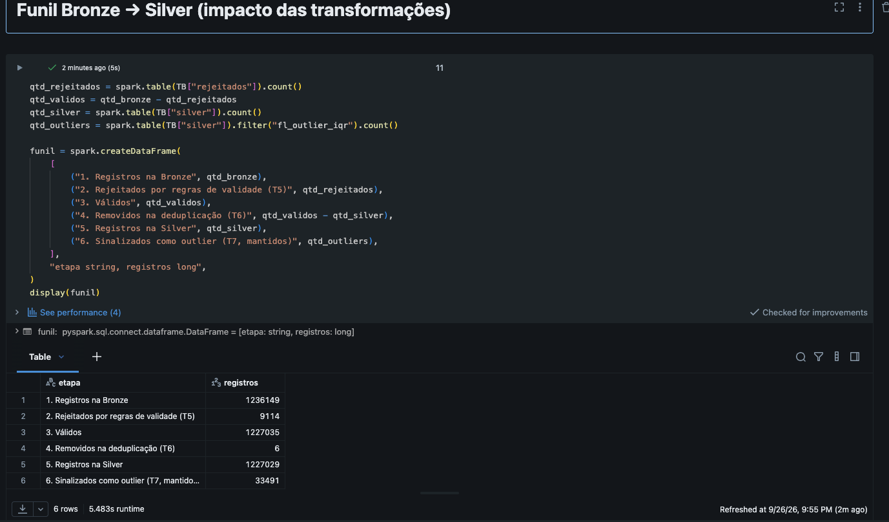

**Integridade referencial do modelo:** todos os registros da Silver encontraram suas quatro dimensões. Nenhum registro foi perdido ou duplicado nas junções.

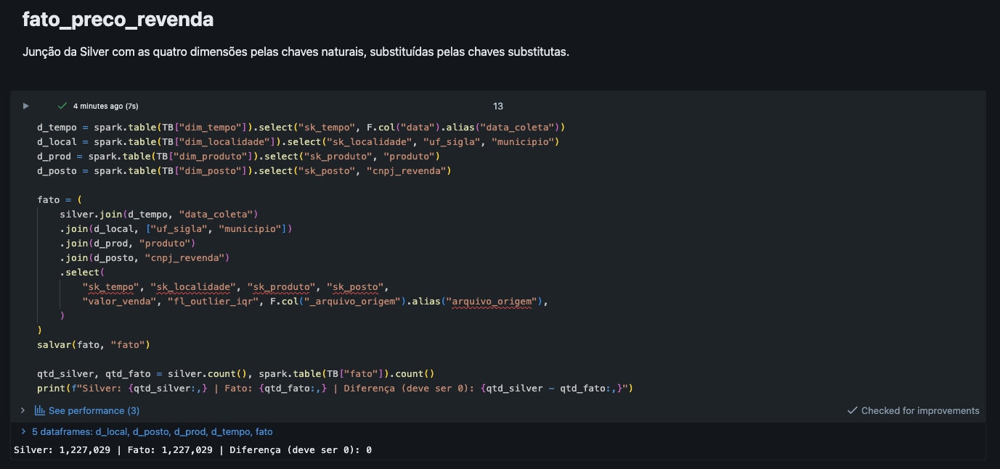

**Histórico transacional (Delta Lake):** cada operação sobre as tabelas gera uma versão auditável (a criação e cada comentário do catálogo), base para o *time travel*.

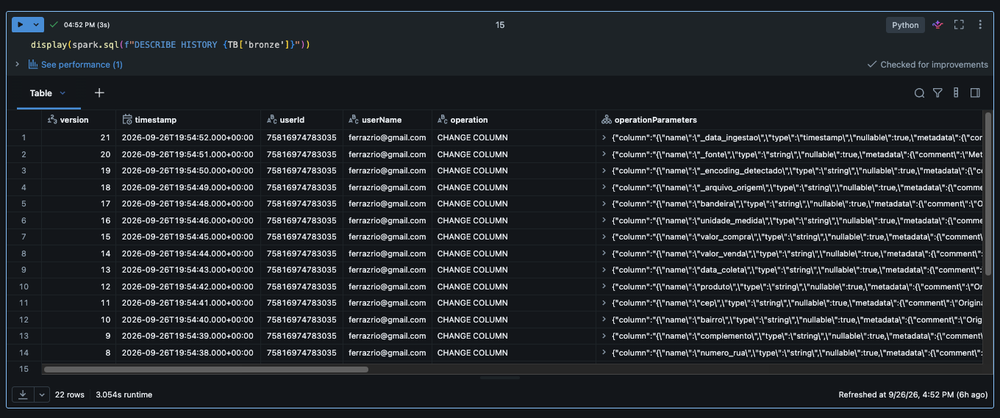

---

## 5. Qualidade de Dados (Etapa 4.5)

A verificação foi feita **sobre a Bronze** (dado como capturado), em **todos os 16 atributos**, nas cinco dimensões pedidas. Os resultados estão persistidos em `silver.relatorio_qualidade` (notebook 02).

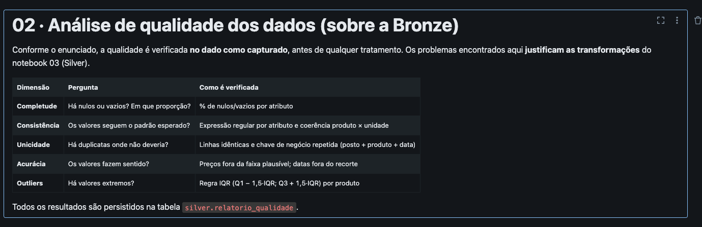

### 5.1 Perfil por atributo

| Atributo | Nulos ou vazios | Completude | Distintos | Consistência (preenchidos) |
|---|---|---|---|---|
| regiao_sigla | 9.114 | 99,26% | 5 | 100% |
| estado_sigla | 9.114 | 99,26% | 27 | 100% |
| municipio | 9.114 | 99,26% | 408 | — |
| revenda | 9.114 | 99,26% | 8.942 | — |
| cnpj_revenda | 9.114 | 99,26% | 17.823 | 100% (14 dígitos) |
| nome_rua | 9.114 | 99,26% | 6.163 | — |
| numero_rua | 9.202 | 99,26% | 3.603 | — |
| **complemento** | **957.242** | **22,56%** | 1.847 | — |
| bairro | 11.366 | 99,08% | 4.386 | — |
| cep | 9.114 | 99,26% | 7.196 | 100% (8 dígitos) |
| produto | 9.114 | 99,26% | 6 | — |
| data_coleta | 9.114 | 99,26% | 416 | 100% (dd/mm/aaaa) |
| valor_venda | 9.114 | 99,26% | 683 | 100% (vírgula decimal) |
| **valor_compra** | **1.236.149** | **0%** | 0 | — |
| unidade_medida | 9.114 | 99,26% | 3 | — |
| bandeira | 9.114 | 99,26% | 49 | — |

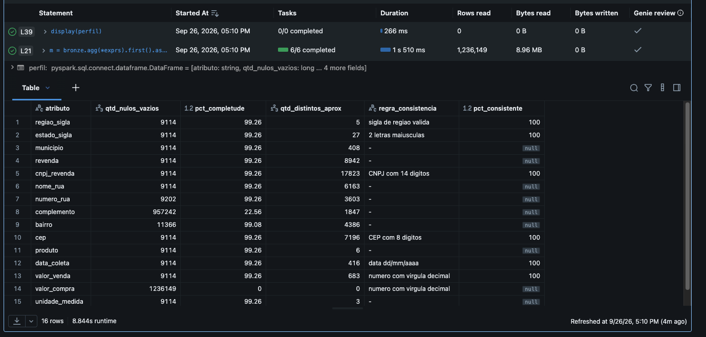
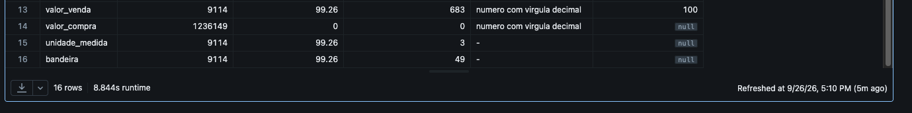

### 5.2 Problemas detectados e tratamento

| # | Problema | Dimensão | Evidência | Tratamento | Onde |
|---|---|---|---|---|---|
| Q1 | **Linhas em branco no CSV** | Completude | O mesmo número de vazios (9.114) em todos os atributos, ou seja, linhas inteiras vazias, e não nulos dispersos | Rejeitadas com motivo registrado | T5 |
| Q2 | **`valor_compra` 100% vazio** | Completude | 1.236.149 vazios; a ANP encerrou essa série em ago/2020 | Mantido e documentado; **inviabiliza a P6** | P6 |
| Q3 | `complemento` com 77% de vazios | Completude | 957.242 vazios | Coluna descartada (sem uso analítico) | T8 |
| Q4 | **GNV com duas grafias de unidade** | Consistência | `R$ / m3` (8.732) e `R$ / m³` (17.945) | Unificação | T1b |
| Q5 | Acentos em categorias (ex.: `SABBÁ`) | Consistência | Tabela de bandeiras | Remoção de acentos | T1 |
| Q6 | Preços e datas armazenados como texto | Consistência | 100% no padrão, mas em texto | Conversão de tipos | T3, T4 |
| Q7 | Máscara no CNPJ e no CEP | Consistência | 100% no padrão com máscara | Manter só dígitos | T2 |
| Q8 | Possível variação de codificação entre arquivos | Consistência | **Verificado, sem ocorrências**: os 3 arquivos em UTF-8, com as mesmas 16 colunas | Detecção automática mantida como proteção | Notebook 01 |
| Q9 | Duplicatas | Unicidade | 9.119 duplicatas exatas = 9.113 linhas em branco repetidas + **6 duplicatas reais** (um único posto, em fev/2026, com o mesmo preço); **0 conflitos de preço** | Deduplicação pela chave de negócio | T5, T6 |
| Q10 | Preços ou datas implausíveis | Acurácia | **Verificado, sem ocorrências**: 0 preços fora de R$ 0,50 a R$ 20,00; datas exatamente entre 01/01/2025 e 30/06/2026 | Regra mantida como proteção para cargas futuras | T5 |
| Q11 | Valores extremos | Outliers | Regra IQR nacional: 19.664 (1,6%) | Regra refinada para **produto × UF × mês** (ver 5.3) | T7 |

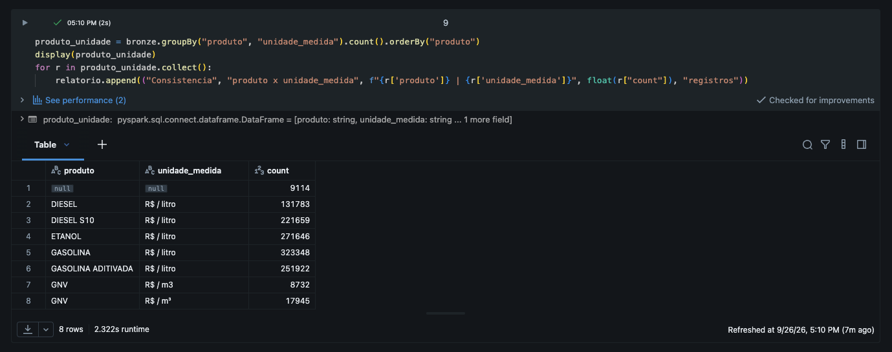
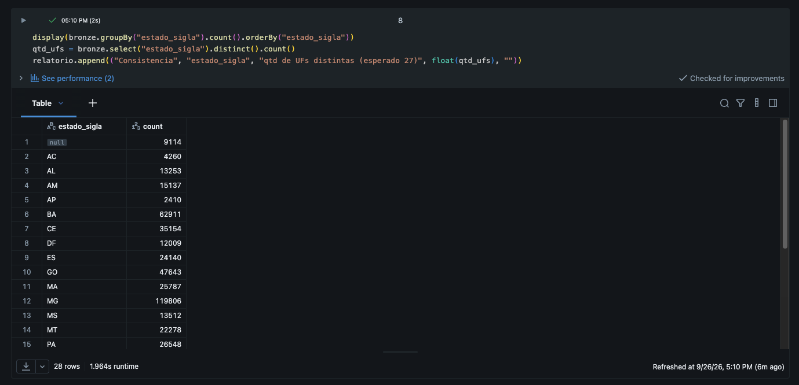
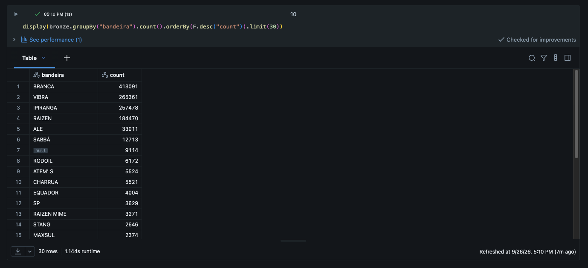
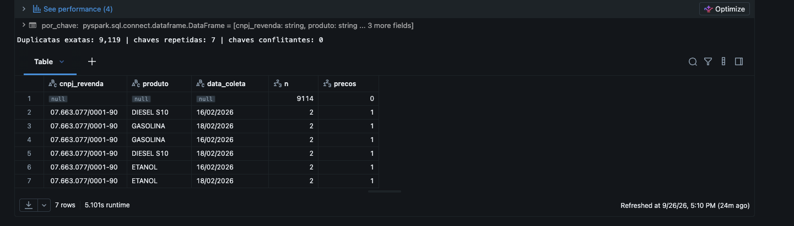
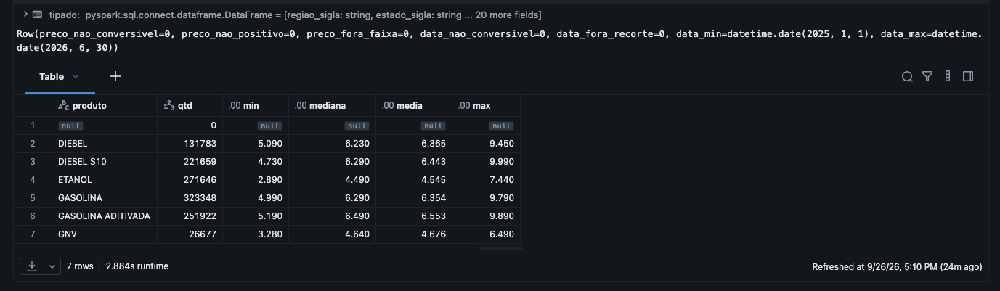

### 5.3 Decisão sobre outliers: como a qualidade influenciou o pipeline

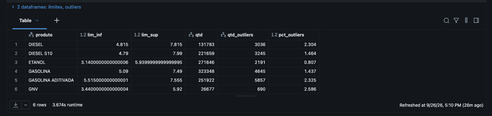

A primeira medição usou a regra IQR **nacional**, por produto. Ao analisar o resultado, identificou-se um **risco de viés**: um preço de R$ 8,50 é atípico na média do Brasil, mas pode ser **normal no Acre ou em Roraima**, onde o custo logístico é maior. Excluir esses preços como outliers **apagaria justamente o sinal que a P2 procura**.

A regra foi então alterada para **produto × UF × mês**: cada posto passa a ser comparado com os concorrentes do mesmo estado, no mesmo mês.

| Regra | Outliers | Quais registros são sinalizados |
|---|---|---|
| Nacional (produto) | 19.664 (1,6%) | Concentrados nos estados estruturalmente mais caros |
| **Adotada (produto × UF × mês)** | **33.491 (2,7%)** | Postos fora do padrão do **próprio mercado local**, espalhados pelo país |

A regra local sinaliza **mais** registros, porque dentro de um estado os preços são mais homogêneos e a faixa "normal" fica mais estreita. Mas elimina o viés regional. **O que importa é quais registros são excluídos, e não quantos.** O efeito aparece na P2: o Acre surge corretamente como o estado mais caro.

Os outliers **permanecem na Silver e no fato**, apenas sinalizados (`fl_outlier_iqr`), e são excluídos só nas análises.

---

## 6. Análise de Dados (Etapa 4.5)

Todas as consultas estão em [`notebooks/05_analise.py`](notebooks/05_analise.py), em SQL sobre a camada Gold, excluindo outliers. As 6 categorias de produto foram conferidas antes das análises:

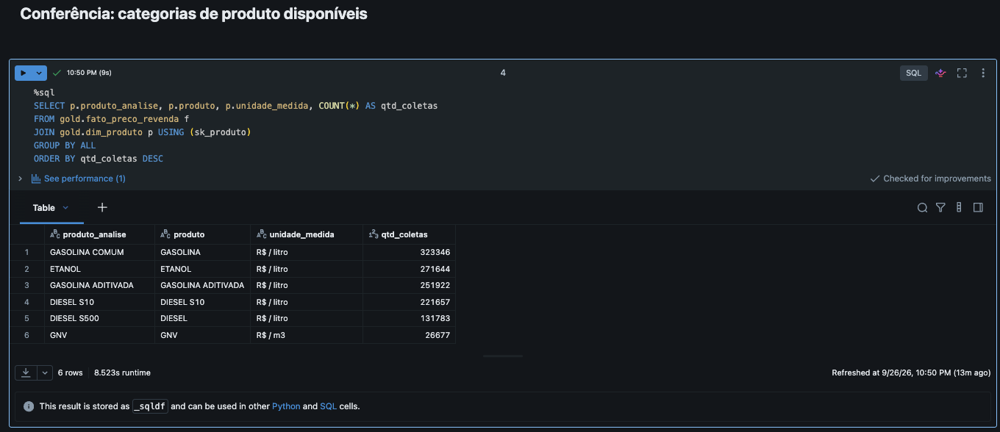

### P1 · Como evoluiu o preço médio mensal?

| Produto | Jan/2025 | Jun/2026 | Variação no período | Maior média mensal |
|---|---|---|---|---|
| Gasolina comum | R$ 6,16 | R$ 6,64 | **+7,7%** | R$ 6,75 (abr/26) |
| **Diesel S10** | R$ 6,16 | R$ 7,10 | **+15,3%** | **R$ 7,45 (abr/26)** |
| Etanol | R$ 4,35 | R$ 4,43 | **+1,8%** | R$ 4,86 (mar-abr/26) |

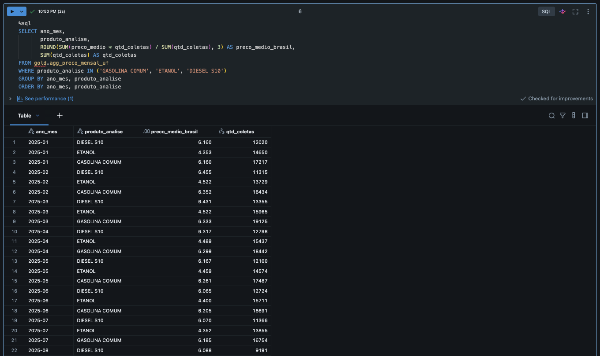
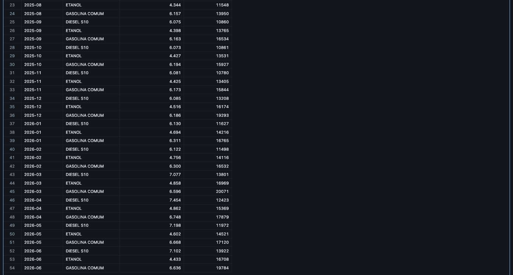
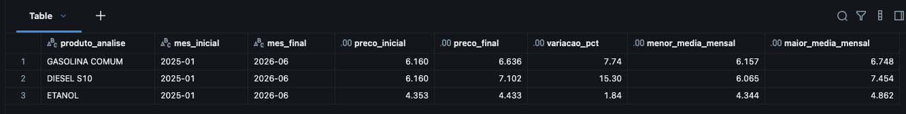

**Discussão:**
- **2025 foi um ano de estabilidade.** O diesel S10 chegou a **cair** cerca de 6% (de R$ 6,46 em fev/25 para cerca de R$ 6,07 entre jun e nov/25), e a gasolina oscilou entre R$ 6,16 e R$ 6,35.
- **Toda a alta do período se concentrou em março e abril de 2026.** O **diesel S10 subiu 21,8% em dois meses** (R$ 6,12 → R$ 7,45) e a gasolina, 7,1% (R$ 6,30 → R$ 6,75). Não houve uma tendência gradual, e sim um **choque**.
- **Contexto externo (não medido pelo pipeline):** o noticiário de março de 2026 registra forte volatilidade do petróleo, associada a um conflito envolvendo o Irã, um reajuste da Petrobras no diesel em 14/03/2026 e medidas do governo para conter o preço (subvenção ao diesel e mudanças tributárias). O **momento** e a **ordem de grandeza** do choque nos dados da ANP são **consistentes** com esses eventos, mas o pipeline não contém dados de petróleo ou de política de preços. Trata-se de **coincidência temporal consistente, e não de causalidade demonstrada**.
- **O diesel reagiu três vezes mais que a gasolina.** Uma hipótese plausível é a maior dependência de importação do diesel no Brasil, que o expõe mais ao preço internacional.
- **O diesel recuou parcialmente** a partir de maio/2026 (R$ 7,10 em junho), sem voltar ao patamar anterior, o que é compatível com o efeito das medidas de contenção.
- **O etanol segue um ciclo próprio:** sobe de dez/25 a abr/26 e cai 8,8% em maio e junho. O padrão é compatível com a **sazonalidade da cana-de-açúcar** (entressafra no início do ano e safra do Centro-Sul a partir de abril), e não com o petróleo.
- **Ressalva:** a média nacional é ponderada pelas coletas, e São Paulo representa 28% delas. A média reflete mais o Sudeste do que um "Brasil médio".

### P2 · Quais UFs são mais caras e mais baratas?

| Produto | Mais cara | Mais barata | Diferença |
|---|---|---|---|
| Gasolina comum | **AC** R$ 7,59 | **PI** R$ 6,08 | **R$ 1,51 (+24,9%)** |
| Diesel S10 | **AC** R$ 7,86 | **PE** R$ 6,14 | **R$ 1,73 (+28,1%)** |

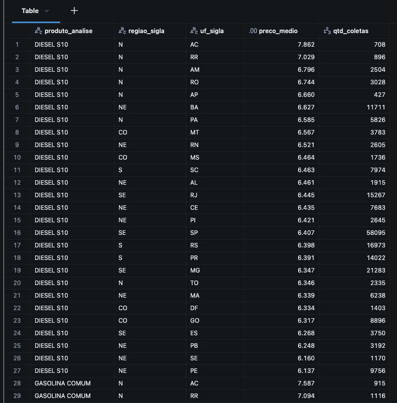
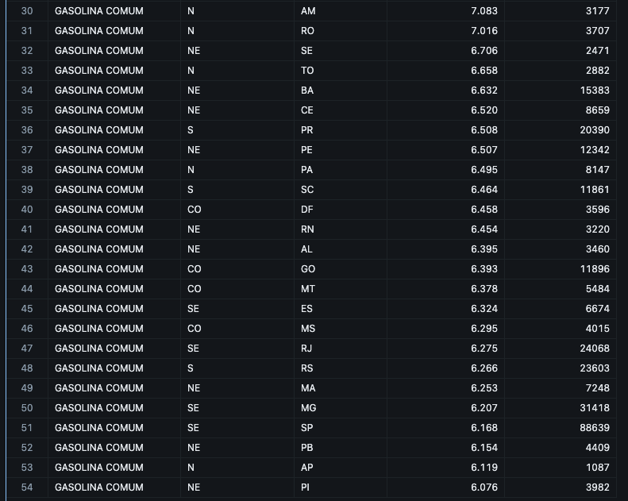
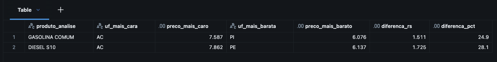

**Discussão:**
- **A Região Norte concentra os preços mais altos.** No diesel S10, as **5 UFs mais caras são todas do Norte** (AC, RR, AM, RO e AP). Na gasolina, as **4 mais caras** também (AC, RR, AM e RO, todas acima de R$ 7,00). A hipótese mais provável é o **custo logístico**: são estados distantes das refinarias e abastecidos por rotas longas. O pipeline não tem dados de frete para comprovar.
- **O consumidor do Acre paga R$ 1,50 a R$ 1,70 a mais por litro** que o dos estados mais baratos, ou **R$ 75 a R$ 86 a mais por tanque de 50 litros**. Como a média cobre 18 meses, a diferença é estrutural, e não pontual.
- **Exceções:**
  - **São Paulo** tem uma das gasolinas mais baratas (R$ 6,17, a 4ª menor), o que é compatível com a proximidade de refinarias e a alta concorrência.
  - A **Bahia** tem diesel caro para o Nordeste (R$ 6,63, o 6º mais caro), e foi citada no noticiário como a maior alta de diesel no choque de março/26. Uma hipótese é o abastecimento por uma refinaria com política de preços própria. **Não comprovado pelo pipeline.**
  - O **Amapá** tem gasolina barata (R$ 6,12), mas com amostra pequena (1.087 coletas), o que torna a conclusão frágil.
- **Conexão com a qualidade de dados:** o Acre aparece corretamente no topo porque a regra de outliers por UF (seção 5.3) **não excluiu** seus preços legitimamente altos.
- **Ressalva:** UFs pequenas têm poucas coletas (AC com 708 no diesel), então suas médias têm mais incerteza.

### P3 · Quando o etanol compensa?

Regra de mercado adotada: o etanol é vantajoso quando custa **até 70%** do preço da gasolina, por causa do seu menor rendimento energético.

| Situação | UFs |
|---|---|
| **Etanol vantajoso na maioria dos meses** | **MS (100%)**, **SP (88,9%)**, MT (77,8%) e PR (77,8%) |
| Vantajoso às vezes | GO (44,4%), MG (27,8%), AC e DF (16,7%), BA (5,6%) |
| **Nunca vantajoso** | **18 UFs**: o restante do Nordeste e do Norte, além de RJ, ES, SC e RS. O pior caso é o AP (razão média de 0,90) |

| Período | UFs com etanol vantajoso | Razão média entre as UFs |
|---|---|---|
| Jan a nov/2025 | 4 a 6 | 0,73 a 0,75 |
| **Dez/2025 a mar/2026** | **1 a 2** | até **0,78** |
| **Mai e jun/2026** | **7 a 8** | **0,72** |

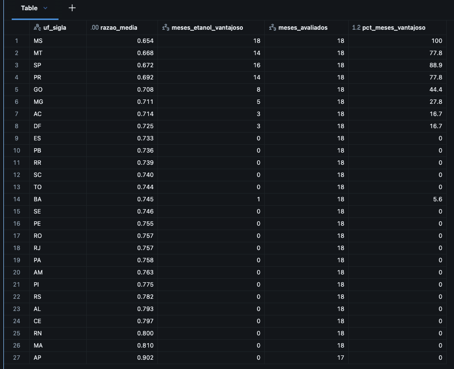
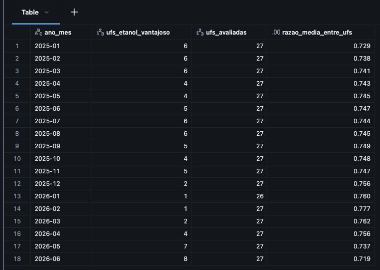

**Discussão:**
- **O etanol compensa quase só no Centro-Sul produtor de cana** (MS, SP, MT, PR, GO e MG). **Em 18 dos 27 estados, abastecer com etanol nunca compensou** no período. A recomendação "etanol compensa" vale para uma parte do país, e não para o Brasil como um todo.
- **A vantagem é sazonal e conversa com a P1.** O pior momento (dez/25 a mar/26, com só 1 ou 2 UFs) coincide com a **entressafra**, quando o etanol subiu. O melhor momento (jun/26, com 8 UFs, o máximo da série) combina **dois efeitos**: o etanol caiu com a safra, e a gasolina ficou mais cara depois do choque de março. Ou seja, **o choque do petróleo tornou o etanol mais competitivo**.
- **O caso do Acre** mostra que a razão depende dos dois preços. O estado não é produtor, mas o etanol compensou em 3 meses porque a **gasolina acreana é a mais cara do país** (P2).
- **Ressalva:** a regra dos 70% é uma aproximação. O rendimento real varia com o veículo e o uso.

### P4 · Postos bandeirados cobram mais?

| Produto | Diferença simples (P4a) | **Mesmo município e mês (P4b)** | Casos em que o bandeirado é mais caro |
|---|---|---|---|
| Gasolina comum | +R$ 0,144 (+2,3%) | **+R$ 0,117 (+1,9%)** | 80,9% |
| Diesel S10 | +R$ 0,123 (+1,9%) | **+R$ 0,125 (+2,1%)** | 72,7% |
| Etanol | +R$ 0,164 (+3,7%) | **+R$ 0,146 (+3,4%)** | 83,8% |

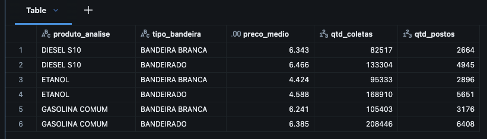
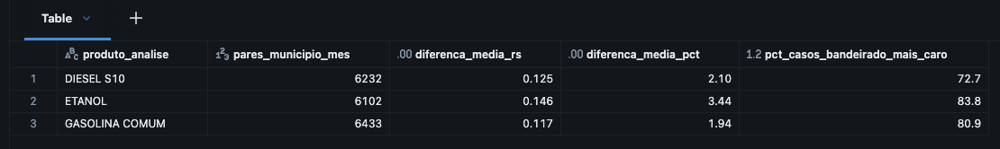
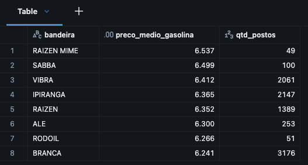

**Discussão:**
- **Sim, os postos bandeirados cobram mais, de forma consistente, mas pouco:** R$ 0,12 a R$ 0,15 por litro (2% a 3,5%), ou **cerca de R$ 6 por tanque de gasolina**. É um prêmio pequeno perto das diferenças regionais da P2 (mais de R$ 1,50).
- **Por que controlar pela localização (P4b):** na comparação simples, a diferença da gasolina é de R$ 0,144. Comparando **postos do mesmo município no mesmo mês**, ela cai para R$ 0,117. Cerca de **20% da diferença bruta vinha da geografia** (os postos de bandeira branca estão, em média, em locais mais baratos), e não da bandeira. Sem esse controle, o efeito da bandeira seria superestimado.
- **A regra não é absoluta:** em 16% a 27% dos casos, o posto de bandeira branca foi **mais caro** que o bandeirado no mesmo município e mês.
- **Entre as três grandes distribuidoras** (Vibra, Ipiranga e Raízen), a diferença é de no máximo R$ 0,06. Na P4c, bandeiras como a Sabbá aparecem no topo, mas isso provavelmente reflete **onde** elas atuam (a Região Norte, a mais cara), e não a marca. Essa consulta não controla a localização e confirma por que a P4b é a resposta mais confiável.
- **Ressalva:** o pipeline não mede qualidade, serviços ou programas de fidelidade, que podem justificar parte do prêmio.

### P5 · Em quais capitais a dispersão de preços é maior? *(fronteira)*

| Grupo | Capitais | Diferença média entre o posto mais caro e o mais barato (no mês) | Coeficiente de variação |
|---|---|---|---|
| **Maior dispersão** | **São Paulo**, Belo Horizonte, **Rio de Janeiro** e Belém | R$ 0,82 a **R$ 1,47** | 3,7% a 4,8% |
| **Menor dispersão** | **Boa Vista**, Manaus, Aracaju e João Pessoa | **R$ 0,09** a R$ 0,23 | 0,5% a 1,0% |

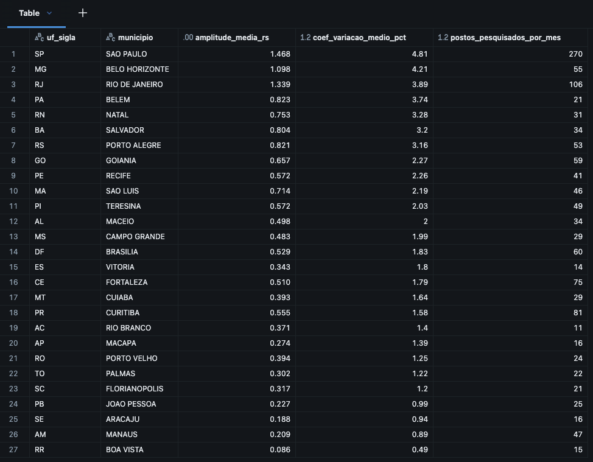

**Discussão:**
- **Nas grandes metrópoles, pesquisar preço compensa mais.** Em São Paulo, a diferença média entre o posto mais caro e o mais barato pesquisados foi de **R$ 1,47 por litro**, ou cerca de **R$ 73 por tanque**.
- **Boa Vista combina preço alto e preços quase uniformes:** Roraima tem a 2ª gasolina mais cara do país (P2), e a diferença entre postos na capital é de apenas R$ 0,09. Na literatura de defesa da concorrência, esse padrão costuma motivar a investigação de **baixa competição**. ⚠️ **É apenas uma hipótese.** O pipeline não tem elementos para afirmar nada sobre conduta de mercado.
- **Ressalva metodológica:** a diferença entre o posto mais caro e o mais barato cresce naturalmente com o número de postos pesquisados (cerca de 270 por mês em SP contra cerca de 15 em Boa Vista). O coeficiente de variação, menos sensível a isso, confirma o mesmo ranking, mas a comparação entre capitais de portes muito diferentes deve ser lida com cautela.
- **Avaliação:** respondida **parcialmente**. A dispersão foi medida, mas explicar suas causas exigiria dados que o pipeline não tem.

### P6 · É possível estimar a margem bruta da revenda? *(fronteira)*

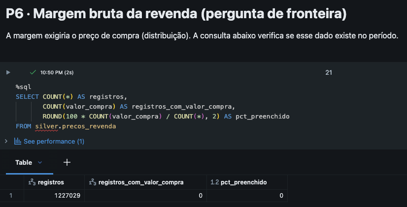

**Resultado:** **não é possível.** O campo `valor_compra` está **0% preenchido** nos 1.227.029 registros. Isso confirma o metadado da ANP: a série do preço de distribuição foi **descontinuada em agosto de 2020**.

**Discussão:** a pergunta foi mantida no objetivo, conforme orientado, porque o resultado negativo também é um achado: ele mostra que **esta fonte não sustenta análises de margem** a partir de 2020. Um caminho alternativo seria cruzar os preços de revenda com outras publicações da ANP sobre preços de distribuição (ver Trabalhos futuros).

### P7 · Quais UFs sofreram a maior alta no choque de 2026? *(adicionada na análise)*

Comparação do preço médio de **fevereiro/2026** (antes do choque) com **abril/2026** (pico), por UF.

| Produto | Maiores altas | Menores altas | Faixa |
|---|---|---|---|
| **Diesel S10** | **BA +31,2%**, PI +26,0%, PR +24,9%, SE +24,9%, MA +23,8% | **AC +8,5%**, AP +10,7%, AL +13,4%, RR +13,5%, ES +14,9% | +8,5% a +31,2% (**todas as UFs subiram**) |
| **Gasolina comum** | **BA +14,1%**, RR +12,6%, PI +12,1%, SE +11,2%, MA +11,2% | **AC −0,7%**, GO +2,1%, DF +2,2%, RN +2,7%, SC +3,8% | −0,7% a +14,1% |

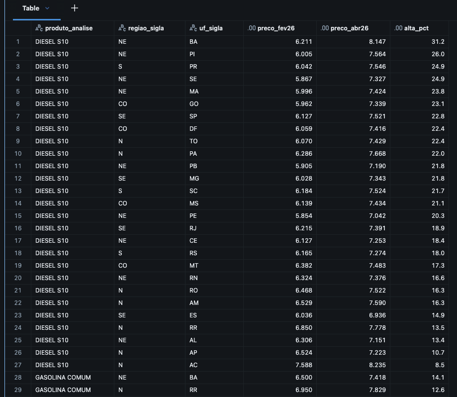
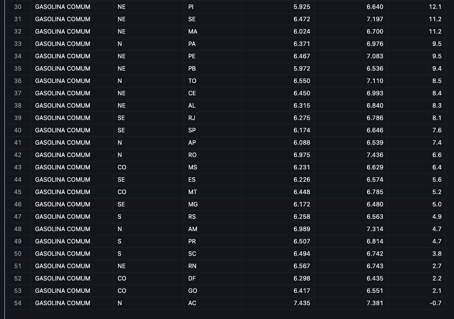

**Discussão:**
- **O choque não foi uniforme.** No diesel, a alta variou de 8,5% a 31,2% entre as UFs, ou seja, quase **quatro vezes** entre o menor e o maior impacto. A média nacional da P1 (+21,8%) esconde essa heterogeneidade.
- **Achado principal: os estados mais caros foram os que menos subiram.** Os estados do Norte, que lideram o ranking de preços da P2 (AC, AP, RR e AM), estão entre as **menores altas** do diesel. O Acre, o mais caro do país, subiu só 8,5% no diesel e teve **queda de 0,7% na gasolina**. A exceção é **Roraima na gasolina** (+12,6%, a 2ª maior alta), um lembrete de que o padrão é forte no diesel, mas não é uma regra absoluta. Em consequência, **o choque comprimiu as diferenças regionais**: em abril/2026, o diesel da Bahia (R$ 8,15) ficou praticamente no nível do Acre (R$ 8,24), quando em fevereiro a diferença era de R$ 1,38.
- **Hipótese para o padrão:** nos estados remotos, o custo logístico é uma parcela maior do preço final e não muda no curto prazo. Um aumento no custo do produto na origem representa, portanto, um **percentual menor** do preço na bomba. Estoques e contratos de abastecimento de prazo mais longo também podem ter amortecido o repasse. O pipeline não tem dados de frete ou de estoque para testar isso.
- **O Nordeste foi o mais exposto:** BA, PI, SE e MA estão entre as maiores altas nos **dois** combustíveis. A **Bahia lidera nos dois produtos**, o que é consistente com o noticiário, que citou o estado como a maior alta do diesel no período, e com a hipótese, já levantada na P2, de uma política de preços de refino própria no estado. **Não comprovado pelo pipeline.**
- **O diesel foi muito mais afetado que a gasolina em todas as regiões**, o que reforça a leitura da P1 sobre a maior exposição do diesel ao mercado internacional.
- **Leitura para o setor de energia:** o impacto de um choque internacional para o consumidor final depende menos da distância e mais da **estrutura de suprimento regional** (de onde vem o combustível e como seu preço é formado). É um ponto relevante para quem planeja logística e contratos de combustível para operações em regiões diferentes.

### Discussão geral

Os resultados, em conjunto, respondem ao problema proposto e mostram que **o preço que o consumidor paga é explicado, em ordem decrescente de importância, por onde ele está, quando ele abastece e em que tipo de posto**:

1. **Onde (a geografia domina):** a diferença entre estados chega a **R$ 1,50 a R$ 1,70 por litro** (P2), mais de **dez vezes** o prêmio da bandeira (P4). O Norte paga o combustível mais caro do país de forma persistente.
2. **Quando (choques externos concentrados):** o período foi de estabilidade, interrompida por um choque concentrado em março e abril de 2026 (P1), que atingiu o diesel com muito mais força. O choque, porém, **não se propagou por igual** (P7): o Nordeste foi o mais atingido e, no diesel, o Norte foi o menos atingido, o que reduziu temporariamente as diferenças regionais. Para quem depende de diesel, como o transporte de cargas, a exposição a choques internacionais é o principal risco de preço, e esse risco varia conforme a região.
3. **Qual combustível (o etanol é regional e sazonal):** a vantagem do etanol depende da região (Centro-Sul), da estação (safra da cana) e até do preço da gasolina, que o choque do petróleo empurrou para cima (P1 × P3).
4. **Em que posto (efeito pequeno, mas real):** a bandeira branca é, em média, R$ 0,12 a R$ 0,15 mais barata, e nas grandes capitais a diferença entre postos pode passar de R$ 1,40 (P5). **Pesquisar preço vale mais em São Paulo do que escolher bandeira.**

Na pirâmide DIKW, o pipeline levou 1,24 milhão de registros brutos (**dado**) a métricas organizadas por tempo, local e posto (**informação**), a padrões interpretados (**conhecimento**) e a recomendações práticas para o consumidor, como "no Nordeste, prefira gasolina" e "em SP, pesquise o posto" (**sabedoria**).

---

## 7. Autoavaliação

### Objetivos atingidos

| Pergunta | Situação | Comentário |
|---|---|---|
| P1 · Evolução mensal | ✅ Respondida | Identificou o choque de mar-abr/2026 e a sazonalidade do etanol |
| P2 · UFs extremas | ✅ Respondida | Padrão regional claro (Norte), com ressalva sobre amostras pequenas |
| P3 · Vantagem do etanol | ✅ Respondida | Resposta por UF e por mês, conectada à P1 |
| P4 · Bandeira | ✅ Respondida | Com controle de localização, o que reduziu o viés da comparação simples |
| P5 · Dispersão nas capitais | ⚠️ Parcial | A dispersão foi medida, mas as causas não, por falta de dados de concorrência e localização |
| P6 · Margem bruta | ❌ Não respondível | O preço de compra deixou de ser publicado pela ANP em 2020 |
| P7 · Choque por UF *(adicionada)* | ✅ Respondida | Surgiu da P1 e revelou o achado mais inesperado do trabalho: o choque comprimiu as diferenças regionais |

O ciclo completo de engenharia de dados foi executado e evidenciado: coleta automatizada, arquitetura medalhão, modelo estrela com PK/FK, catálogo e linhagem no Unity Catalog, qualidade medida em todos os atributos e análise respondendo a 4 das 6 perguntas originais integralmente e a 1 parcialmente. A P7, formulada a partir de um resultado da P1, foi respondida **sem nenhuma alteração no pipeline**, reutilizando o agregado da Gold. Isso mostra, na prática, o valor de um modelo bem estruturado: novas perguntas custam apenas uma consulta.

### Dificuldades

- **Prazo curto** (cerca de 30 horas entre o briefing e a entrega), o que exigiu cortar escopo deliberadamente (uma única fonte, sem orquestração) e priorizar documentação e interpretação.
- **Premissa estatística incorreta, corrigida durante o trabalho:** a regra de outliers nacional parecia adequada, mas a análise dos resultados mostrou que ela introduziria viés regional. A correção (seção 5.3) foi o principal aprendizado sobre a relação entre qualidade de dados e análise. A expectativa inicial de que a nova regra sinalizaria menos registros também não se confirmou: sinalizou mais, mas os registros certos.
- **Detalhes da fonte só visíveis na execução:** as linhas em branco, as duas grafias da unidade do GNV e a ausência total do preço de compra só apareceram na análise de qualidade, e exigiram ajustes no pipeline (T1b).
- **Integração Git:** a credencial do GitHub não foi configurada no Databricks a tempo, então a versão final do código foi publicada no repositório por upload.

### Limitações conhecidas

- A análise é **descritiva, e não causal**. As relações com eventos externos (petróleo, safra, logística) são hipóteses consistentes, e não conclusões do pipeline.
- A pesquisa da ANP é **amostral** e proporcional ao mercado (SP = 28% das coletas), o que pesa nas médias nacionais.
- As **médias não são ponderadas pelo volume vendido**, que não existe nesta base.
- A `dim_posto` simplifica trocas de bandeira (SCD tipo 1).
- A geração de chaves substitutas por `row_number` global funciona para este volume, mas não escala (aviso de desempenho do Spark).

### Trabalhos futuros

1. **Incorporar os volumes de vendas da ANP** para ponderar os preços pelo consumo real.
2. **Cruzar com Brent e câmbio** para testar estatisticamente a relação entre o choque de 2026 e o preço internacional, e **incorporar dados de frete e de origem do suprimento por UF** para testar a hipótese da P7.
3. **Buscar dados de preço de distribuição** em outras publicações da ANP para responder à P6.
4. **Estender a série** para anos anteriores e comparar ciclos de safra e choques.
5. **Orquestrar o pipeline** com *Jobs* do Databricks para carga mensal automática (os arquivos mensais da ANP já estão disponíveis).
6. **Implementar SCD tipo 2** na `dim_posto` para analisar trocas de bandeira.
7. **Medir concorrência local** (número de postos por município, via cadastro da ANP) para aprofundar a P5.

---

## 8. Como reproduzir

1. Criar uma conta no **Databricks Free Edition**.
2. **Workspace → Create → Git folder**, informando a URL deste repositório.
3. Executar, em ordem, os notebooks `01` a `05` da pasta `notebooks` (**Run all** em cada um). O `00_setup` é chamado automaticamente.
4. O notebook 01 baixa os dados diretamente do portal da ANP. Se o ambiente não tiver acesso à internet, baixar `ca-2025-01.zip`, `ca-2025-02.zip` e `ca-2026-01.zip` na [página da ANP](https://www.gov.br/anp/pt-br/centrais-de-conteudo/dados-abertos/serie-historica-de-precos-de-combustiveis), fazer o upload no Volume `bronze.arquivos_anp` e reexecutar.

Os dados não estão incluídos no repositório, conforme permitido pelo enunciado.

### Referências

- ANP. [Série Histórica de Preços de Combustíveis e de GLP](https://www.gov.br/anp/pt-br/centrais-de-conteudo/dados-abertos/serie-historica-de-precos-de-combustiveis) e [metadados](https://www.gov.br/anp/pt-br/centrais-de-conteudo/dados-abertos/arquivos/shpc/metadados-serie-historica-precos-combustiveis-1.pdf).
- AWS. [What is a Data Pipeline?](https://aws.amazon.com/what-is/data-pipeline/)
- Rosal, I. [Dados: Um briefing executivo](https://medium.com/data-hackers/dados-um-briefing-executivo-ee9297325157). Data Hackers, 2021.
- Rosal, I. [Computação em Nuvem: Uma Introdução Executiva](https://medium.com/data-hackers/computa%C3%A7%C3%A3o-em-nuvem-uma-introdu%C3%A7%C3%A3o-executiva-412f5c9b6ebe). Data Hackers, 2021.
- Contexto do choque de 2026 (fonte externa, não usada no pipeline): [ClimaInfo, 16/03/2026](https://climainfo.org.br/2026/03/16/enquanto-o-governo-tenta-segurar-preco-do-diesel-a-petrobras-reajusta-valor-do-produto/); [O Tempo, 31/03/2026](https://www.otempo.com.br/economia/2026/3/31/governo-atualiza-preco-do-diesel-vendido-pela-petrobras-regiao-sudeste-teve-reajuste).
